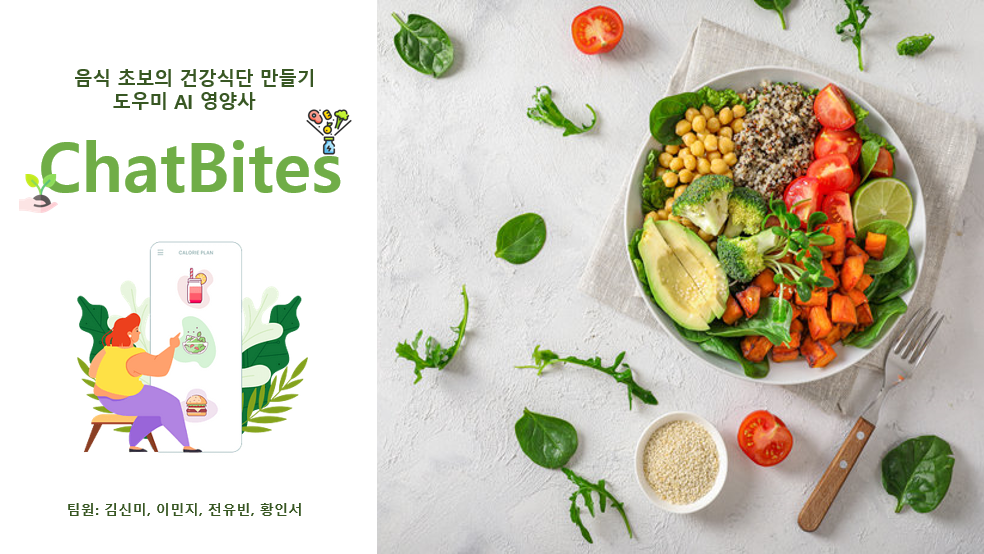
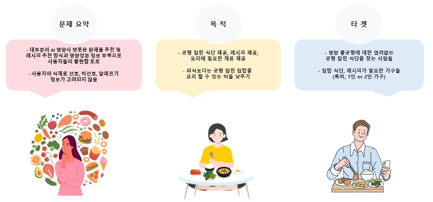
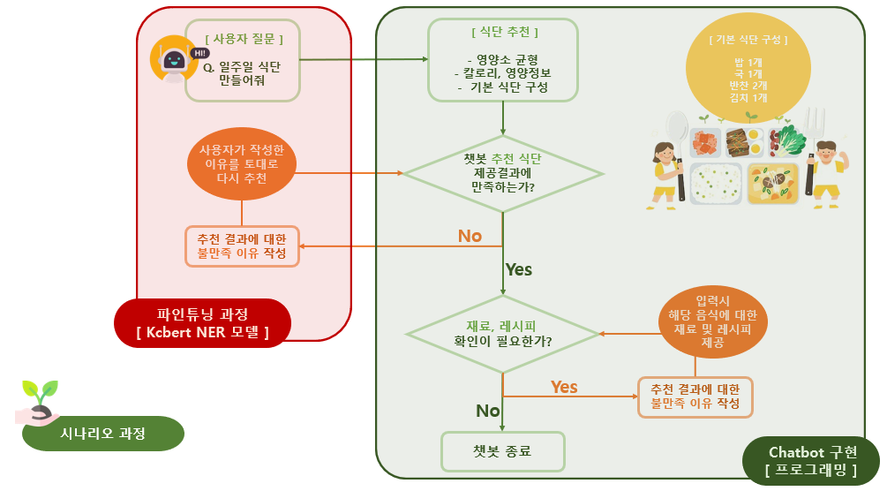
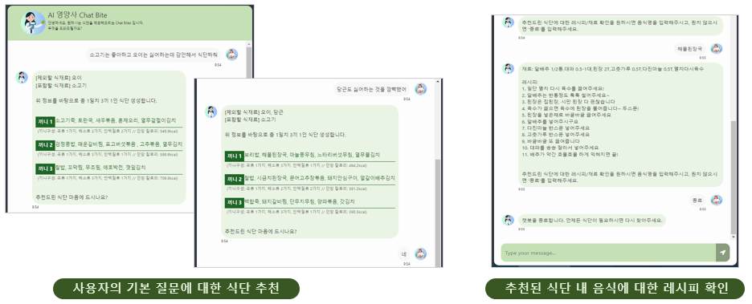
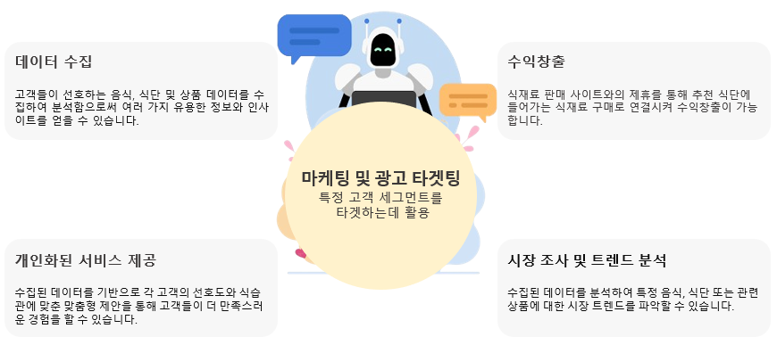

<h1 align="center">
    
</h1>

  <a href="#개요">개요</a> •
  <a href="#기획의도">기획의도</a> •
  <a href="#웹구성도">웹구성도</a> •
  <a href="#스킬">스킬</a> •
  <a href="#기대효과">기대효과</a> •
  <a href="#개선방향">개선방향</a> •
  <a href="#Credits">Credits</a>

## 개요
- 프로젝트 기간: 2024년 2월 13일 ~ 2024년 3월 15일
- 프로젝트 요약: 영양불균형 문제에 대한 하나의 솔루션으로 영양정보와 균형있는 식단을 제공하는 AI 영양사 챗봇 개발

    

## 기획의도
- 현대인들의 신체활동 감소로 인한 비만율 상승
- 채소 및 곡류 섭취 감소 및 당류 섭취 상승에 의한 '비만'과 '영양 결핍'의 심화라는 역설적 상황 발생
- '배부른 영양실조' 유발, 개인적 특성과 환경에 따른 부족 영양소의 차별성 발생
- 부족 영양소에 대한 영양제 과다 섭취에 의한 부작용 발생
- 원인 : 배달음식의 증가,육식과 탄수화물에 편중된 식단, 야외 활동 감소, 자극적인 음식 선호, 극단적 다이어트 등

## 웹구성도
 
#### 1) 파인튜닝 과정 : 데이터 크롤링 > 데이터 전처리를 통한 토큰화 및 태그 처리 > Train 데이터셋을 통한 모델 훈련 > &#160; &#160; &#160; &#160; &#160; &#160; &#160; &#160; &#160; &#160; &#160; &#160; &#160; &#160; Bert 모델 파인튜닝 > Test 데이터셋을 통한 모델 검증
- 데이터 크롤링 : BeautifulSoup 활용 > Selenium 활용 
- 데이터 수집 대상 :
  - 아하(https://www.a-ha.io/, 건강식단 관련 전문가 답변 분야),
  - 네이버 지식인(https://kin.naver.com/, 사용자 플랫폼 1위),
  - 만개의 레시피(https://www.10000recipe.com/, 요리 재료 및 레시피, 요리 난이도 활용),
  - 보건복지부 및 식품의약품안전처 등 
- 데이터 전처리 방법:
  - 크롤링 결과 데이터의 분류 확인, 질문에 대한 데이터 토큰화 및 태그화
  - 크롤링을 통한 확보한 각 개체명의 단어들을 랜덤하게 조합하여 GPT API 프롬프트를 통해 데이터 2배 증강 (총 1,996 질문 데이터)
#### 2) Chatbot 구현 : Ubuntu기반의 Flask와 Bootstrap을 이용한 Chatbot 화면 개발
    

## 스킬

- 파이썬 (Google Colab, Visual Studio Code)
- 언어모델 (Google AI NLP - BERT)
- 웹 프레임워크 (Flask, HTML, JS, CSS, Bootstrap)
- 개발 환경 (Ubuntu, Visual Studio Code)
- Hugging Face (KcBert NER model)

## 기대효과
    

## 개선방향
### Limitations
- 프로젝트 기획, 수요조사, 데이터 수집, 전처리, 알고리즘을 디테일하게 구현하는데 프로젝트 기간이 다소 제한적 
#### 1) 모델 학습측면
- 문장에서 단어의 위치에 따라 개체명 인식 차이 발생 
- 선호/비선호/알러지 표현으로 분류시 모호한 부분으로 인한 개체명 인식 차이 발생 
=> 다양한 개체명 조합을 통한 추가적인 데이터 증식 필요 
=> 모호한 표현들에 대한 개체명 구체화 필요
#### 2) 알고리즘 측면
- 음식 추천 가중치 (frequency)에 대한 명확하고 현실감 있는 로직 구현에 대한 아쉬움
#### 3) 코딩 측면
- 유저의 다양한 입력에 대해 대처할 수 있는 디테일한 코딩에 대한 아쉬움

## Credits
- <a href="https://ratsgo.github.io/nlpbook/docs/ner/train/">Ratsgo NLP - NER 모델 훈련 가이드 참고
- <a href="https://github.com/binary-hood/ChatBot">Binary-hood/ChatBot - Chatbot 프레임워크
